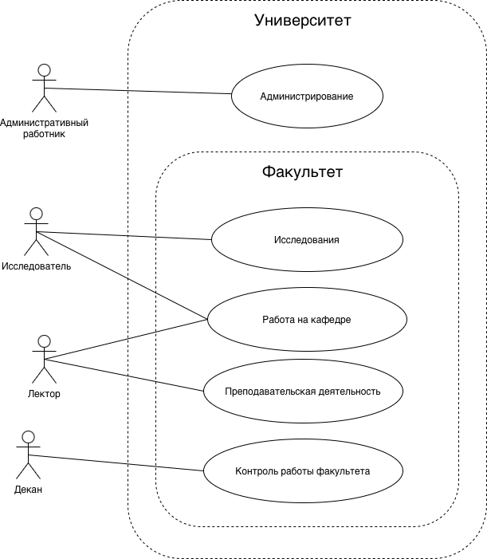

# Отчет по работе: UML-моделирование и реализация модели «Университет»

## Цель
Построить UML-модель предметной области «Университет» (основные диаграммы) и реализовать каркас доменных классов на Java.

## Используемые средства
- Visual Paradigm (исходники проекта: `visual paradigm/миспис5.1.vpp`, `visual paradigm/миспис5_2.vpp`)
- Java (исходный код: каталог `java/`)

## Постановка задачи
- Описать роли и основные функции системы (Use Case).
- Проработать один из ключевых сценариев взаимодействия (Sequence).
- Описать процесс добавления участия в проекте с проверкой корректности данных (Activity).
- Сформировать диаграмму классов и выполнить сравнение вариантов до/после рекомпиляции модели.
- Реализовать набор классов предметной области на Java и выполнить демонстрационный запуск.

## Диаграммы

### Диаграмма вариантов использования (Use Case)
Акторы: административный работник, исследователь, лектор, декан. Отражены функции администрирования, исследования, работы на кафедре/преподавания и контроль работы факультета.



### Диаграмма последовательностей (Sequence)
Сценарий назначения преподавателя на курс (инициатор — декан): запрос списка кафедр, выбор кафедры, получение списка преподавателей, проверка доступности, запрос/показ курсов, назначение на курс и подтверждение результата.


### Диаграмма активностей (Activity)
Процесс добавления участия научного сотрудника в проекте: ввод количества часов, проверка `hours > 0`, создание `Participation`, установка связей с `ResearchStaff` и `Project`, сохранение участия, вывод результата/ошибки.


### Диаграмма классов (Class Diagram)
Сравнение состояния модели до и после рекомпиляции/обновления:

**До рекомпиляции**


**После рекомпиляции**


## Реализация на Java
Исходный код расположен в `java/` и содержит каркас доменной модели (поля + геттеры/сеттеры) и простую демонстрацию в `Main`.

### Классы и назначение
- `Employee` — абстрактный базовый класс сотрудника (`socialSecurityNumber`, `name`, `email`).
- `ResearchPersonal` — научный сотрудник (наследник `Employee`).
- `Lecturer` — лектор (наследник `ResearchPersonal`).
- `Dean` — декан (наследник `Employee`).
- `AdministrativePersonal` — административный персонал (наследник `Employee`).
- `University` — сущность университета (`numberOfEmployers`).
- `Faculty` — факультет (`name`, `attribute`).
- `Institute` — институт (`name`, `address`).
- `Course` — курс (`uniqueNumber`, `name`, `weeklyDuration`).
- `Project` — проект (`name`, `startingDate`, `endDate`, `hours`).
- `Participation` — участие в проекте (`hours`).

### Демонстрационный запуск
`java/Main.java` создает экземпляры перечисленных классов, заполняет поля через сеттеры и выводит значения в консоль.

Сборка и запуск (из корня репозитория):
```bash
cd java
javac *.java
java Main
```

## Результаты
- Подготовлен комплект UML-диаграмм (Use Case, Sequence, Activity, Class).
- Реализован набор классов предметной области на Java и демонстрационный пример использования.

## Вывод
UML-диаграммы позволили зафиксировать роли, сценарии и структуру предметной области «Университет». Реализация на Java подтверждает структуру модели на уровне классов и обеспечивает основу для дальнейшего развития логики и связей между сущностями.
